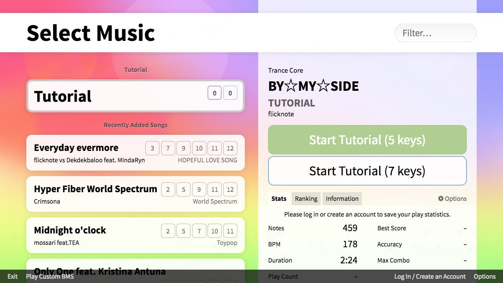
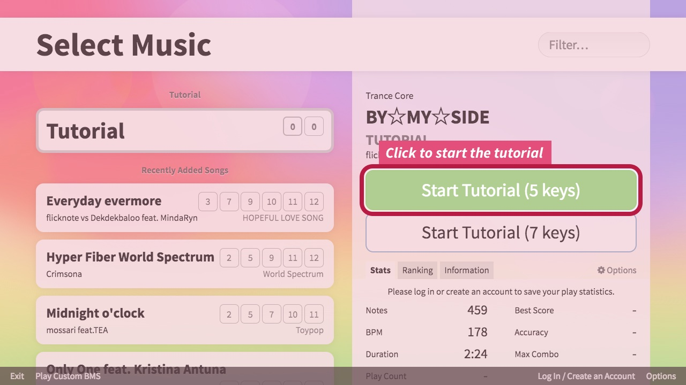
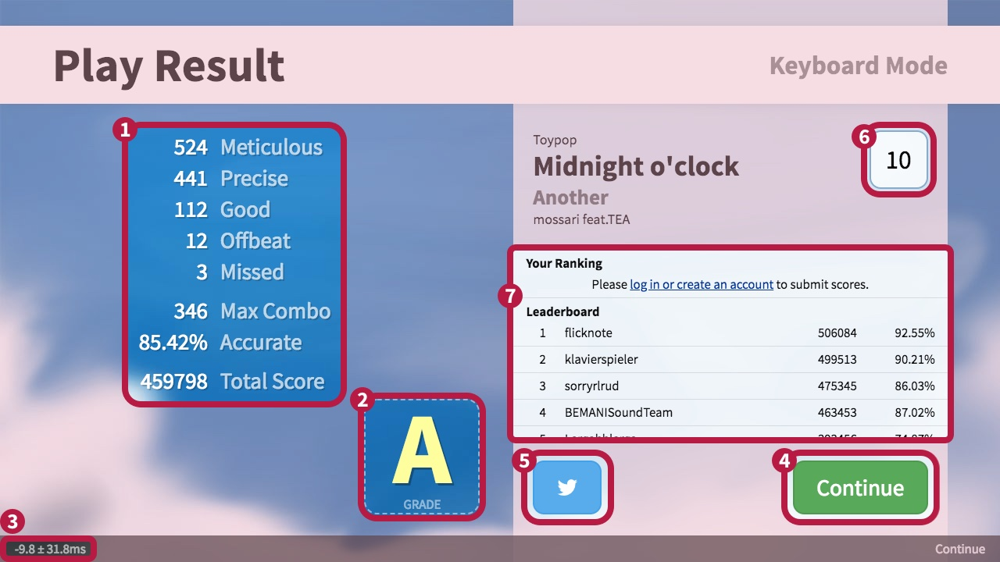

Bemuse is a web-based, online rhythm action game.

In this game, notes fall down from the top of the screen. When they reach the
bottom of the play area, you have to press the corresponding button. Hit the
notes correctly to recreate the song!

## Entering the game

Go to [bemuse.ninja](https://bemuse.ninja/) in your web browser. You will see
the title screen:

Supported web browsers include:

* Google Chrome (latest version)
* Mozilla Firefox (latest version)
* iOS Safari
* Android Chrome (Oreo and above)

Click the **Enter Game** button.

## Select game mode

Next, you will see the **game mode selection screen.**

Select the game mode you want to play. If you are a newcomer, select the
**Keyboard Mode**.

## Music selection screen

Next, you will the **music selection screen**, containing a list of songs:

## Try out the tutorial

The first song in the list is the **Tutorial.** Click the **“Start Tutorial (5
keys)”** button to start it:

The tutorial will start loading. Once the tutorial is loaded, press
<kbd>Enter</kbd> to begin the game.

The tutorial will then teach you some basic gameplay. While inside the game, you
can press the <kbd>Esc</kbd> key a couple of times to exit the tutorial.

As the tutorial probably has taught you, the levels in this game can range all
the way from BEGINNER to INSANE.

## Play more songs

Now you can start playing more songs!

1.  Select the song you want to play.
2.  Select the chart by clicking on it.
3.  Click on that chart again to play it.

## Gameplay

After the song finish loading, press <kbd>Enter</kbd> to begin playing the song.

There are many elements in the gameplay screen:

1.  The **notes area,** where notes will appear.

2.  The **score** of your game play. The more accurate you play, the more score
    you get! The maximum score for every level is 555555.

3.  The **stats** box contains the information about your accuracy.

4.  The **BPM indicator** shows how fast the song is, measured in beats per
    minutes.

5.  The **now playing** box shows the information about the current song.

6.  The **options** box shows the note speed.

### Exiting game and restarting game

While in game, you can use these keys to exit or restart the game:

| Key            | Action            |
| -------------- | ----------------- |
| <kbd>Esc</kbd> | Exit the game.    |
| <kbd>F1</kbd>  | Restart the game. |

## Adjusting note speed

As you play higher-level songs, notes becomes more dense and it becomes harder
to read the notes and time them correctly.

To make it easier to read the notes, you can increase the **note speed.** The
note speed multiplier makes note fall down faster, but it also means notes are
more spaced apart:

To adjust the note speed in-game, use these keys:

| Key                                                 | Action                       |
| --------------------------------------------------- | ---------------------------- |
| <kbd>&uarr;</kbd> (Arrow Up)                        | Increase note speed by 0.5x. |
| <kbd>&darr;</kbd> (Arrow Down)                      | Decrease note speed by 0.5x. |
| <kbd>Alt</kbd>-<kbd>&uarr;</kbd> (Alt + Arrow Up)   | Increase note speed by 0.1x. |
| <kbd>Alt</kbd>-<kbd>&darr;</kbd> (Alt + Arrow Down) | Decrease note speed by 0.1x. |

## Result screen

After finishing a song, you will see the result screen:

1.  The **Result Table** shows the results of your game play:

    * The first 5 rows show how many notes you hit or missed.

    * The **Max Combo** shows the highest streak of note hits.

    * The **Accuracy** shows how accurate you played in percentage. Click on
      this number to see more detailed information.

    * The **Total Score** shows the final score of your performance.

    For more information, see the dedicated page on
    [Scoring and Judgment](./scoring-and-judgment.md).

2.  The **Grade** shows the result grade calculated from the score, according to
    the grading table:

    | Grade | Minimum Score |
    | ----- | ------------: |
    | F     |             0 |
    | D     |        300000 |
    | C     |        350000 |
    | B     |        400000 |
    | A     |        450000 |
    | S     |        500000 |

3.  The statistical number at the bottom left shows the _mean_ and _standard
    deviation_ values for your gameplay. This is for advanced players.

4.  The **Continue** button takes you back to Music Selection Screen.

5.  The **Twitter** button lets you share your score on Twitter.

6.  Click on the **Chart Level** to play this level again.

7.  The **Leaderboard** shows the top scorers of this level.

## Adjusting options

TODO

## Ranking system

TODO

## Custom songs

TODO
